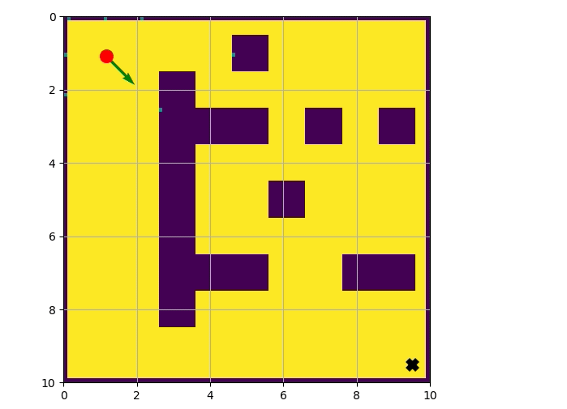
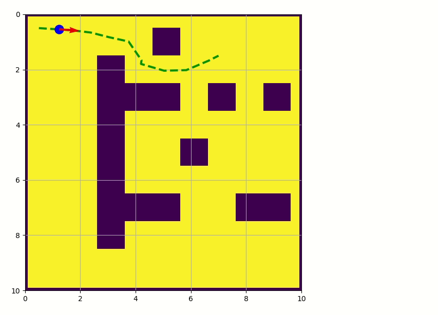
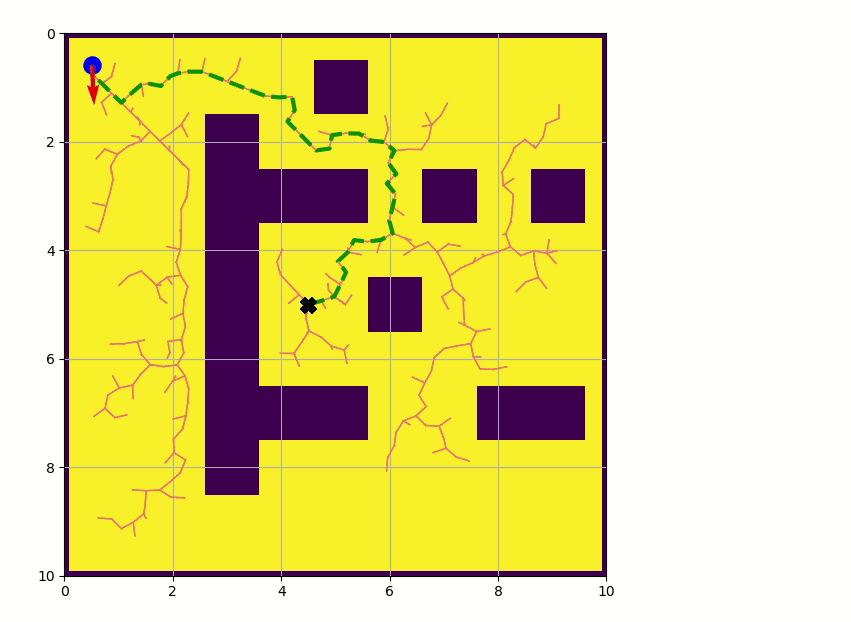
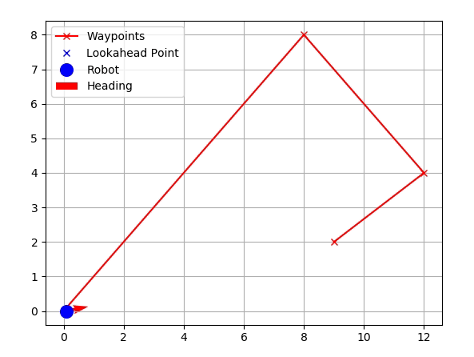

# Path Planning and Control

In this project, we implement a number of path planning and control algorithms. Differential Drive and Bicycle motion models are developed for simulating the robot.

## Usage

**Note:** This project has only been tested on Ubuntu 16.04 and Ubuntu 18.04

If setting up for the first time, follow these instructions to run the demos:

1. Install python dependencies:
    - If using conda (install + activate environment):
        
            conda env create -f environment.yml -n path-planning
            conda activate path-lanning
     
    - If using pip (requires python 3.6):
    
            pip install -r requirements.txt
        
2. Navigate to the working directory of the demos:

        cd path_planning
        
## Path Planning and Control Demos

### Potential Field

Guide a differential drive robot to a goal point using the potential field algorithm. A laser scanner is simulated to find distances to obstacles using Bresenham's rasterization algorithm.

Run the demo:

        python pf_demo.py
        
### Probabilistic Roadmap (PRM)

") 

Path planning using the Probabilistic Roadmap to 4 waypoints and control of a differential drive to each waypoint (and achieving a particular heading at each waypoint). A KDTree is implemented for an efficient generation of the roadmap.

Run the demo:

        python prm_demo.py
        
### Rapidly-exploring Random Trees (RRT)

A bidirectional tree search version of RRTs (RRT-Connect) is implemented here, and a differential drive robot is controlled to visit 4 waypoints

Run the demo:

        python rrt_demo.py

### Pure Pursuit Controller

Run the demo:

        python pure_pursuit_demo.py

### Stanley Controller

Run the demo:

        python stanley_demo.py
